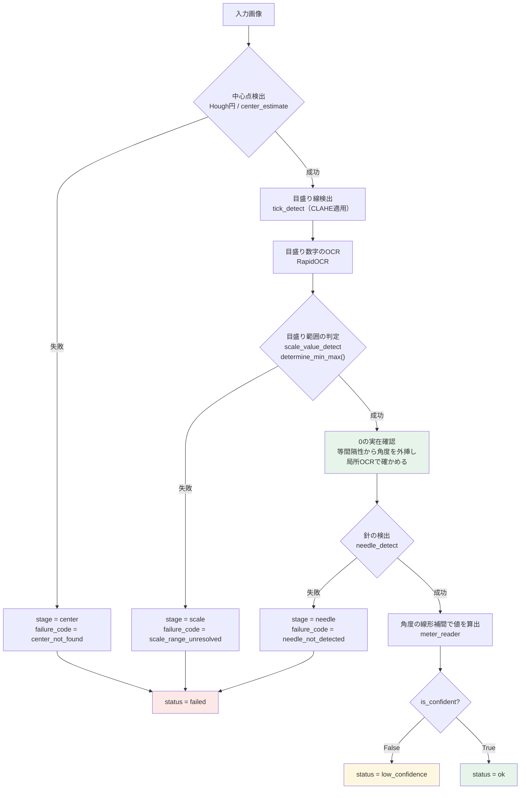
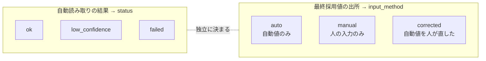

# システム構成図

卒論3章（システム設計）と4章（実装）に載せる図のソース。**Mermaid記法**なので GitHub 上でそのまま
描画される。卒論へ貼るときは画像として書き出す。

**2026-09-13時点の実装に一致させてある。** 図とコードがズレたらこのファイルを直す。

---

## 図1: 全体のデータフロー（撮影から一覧まで）

```mermaid
flowchart LR
    subgraph Android["Android端末（オフラインで動く）"]
        CAM["カメラ撮影<br/>CameraCapturePanel.kt"]
        FILE["端末内に保存<br/>getExternalFilesDir(PICTURES)/captures/<br/>yyyyMMdd_HHmmss_SSS.jpg"]
        QUEUE[("送信キュー<br/>Room DB<br/>QueueItem")]
        WORKER["送出ワーカー<br/>QueueSendWorker.kt"]
        CAM --> FILE
        FILE --> QUEUE
        QUEUE --> WORKER
    end

    subgraph Transfer["受け渡し"]
        FOLDER["公開フォルダ<br/>FolderSender.kt<br/>画像 + サイドカーJSON"]
        HTTP["HTTP送出<br/>HttpSender.kt<br/>（O-05、優先度低）"]
    end

    subgraph PC["PC側"]
        WATCH["フォルダ監視<br/>manager/watcher.py<br/>watchdog"]
        SIDE["サイドカー読み込み<br/>manager/sidecar.py<br/>機器名・現場真値"]
        PIPE["読み取りパイプライン<br/>meter_pipeline.read_meter()"]
        INGEST["取り込み<br/>manager/ingest.py<br/>status/failure判定"]
        DB[("SQLite<br/>manager.db<br/>meter_readings")]
        UI["一覧・絞り込み<br/>app.py（Streamlit）"]
        WATCH --> SIDE
        SIDE --> PIPE
        PIPE --> INGEST
        INGEST --> DB
        DB --> UI
    end

    WORKER --> FOLDER
    WORKER -.未実装.-> HTTP
    FOLDER --> WATCH

    style CAM fill:#e8f0fe
    style UI fill:#e6f4ea
    style DB fill:#fff4e5
    style HTTP stroke-dasharray: 5 5
```

**設計上の要点**

- **オフライン前提。** 撮影したその場で通信できなくても、端末内のキューに溜めて後から送る。
  キューは `PENDING → SENDING → SENT` で遷移し、送信中にアプリが落ちた項目は
  次回起動時に `PENDING` へ戻して再送する（`recoverInterruptedSends`）
- **画像は端末の共有領域に出さない。** アプリ専用領域に保存し、`allowBackup=false` で
  Google ドライブへの自動バックアップも止めている。企業から受け取った画像を外部へ出さないため
- **機器名と現場真値はサイドカーJSONで運ぶ。** 画像ファイルと同名の `.json` を隣に置く方式で、
  画像フォーマットに依存せず、後から真値を追記することもできる

---

## 図2: 読み取りパイプラインの段階と失敗段階

**この図で強調する点**

- **緑の「0の実在確認」が本研究の要**（`scale_value_detect.py` 1144〜1155行）。
  OCRが盤面の「0」を読み落としても、他の数字との等間隔性から 0 があるべき角度を推定し、
  その座標で局所OCRを走らせて実在を確かめる。**この処理はVLM判定より手前にあり、
  `use_vlm=False` でも動く。** v2で発生した目盛り範囲の取り違え（引用誤差 24.97 %FS）は
  ここで解消された
- **失敗しても捨てずに記録する。** どの段で落ちたかを `failure_stage` / `failure_code` に残すので、
  後から失敗の内訳を集計できる（撮り直しの判断材料になる）
- **`low_confidence` は失敗ではない。** 値は出ているが目盛り数が少ないなどで信頼度が低い状態。
  `failed` と区別して記録する

---

## 図3: レコードの状態（status と input_method は独立）

**`status` は人の入力では変化しない。** 自動読み取りが失敗した画像に現場の真値を入力した場合、
`status = failed` かつ `input_method = manual` という組み合わせになる。
**両者を1つの列にまとめると、この状態が表せなくなる。**
